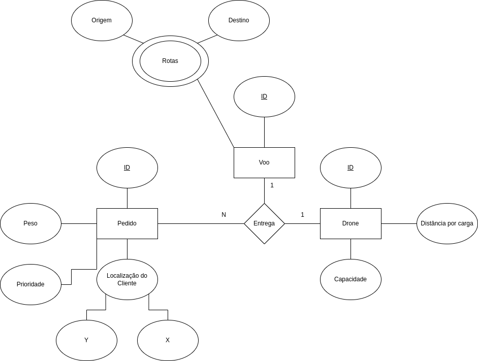
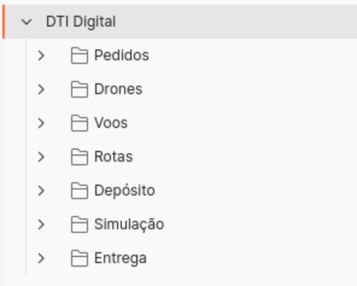

# Simulador de Encomendas em Drone

Solução teste prático do processo seletivo para estágio na [DTI Digital](https://dtidigital.com.br).

## Modelagem

Para este projeto foi desenvolvido um Diagrama de Entidade Relacionamento Estendido (EER):



## Tecnologias Utilizadas

Neste projeto foram utilizadas as seguintes tecnologias:

- Java
- Spring Boot
- Gradle
- FlyWay
- Docker
- MySQL

## Requisitos

Para executar este programa é necessário ter as seguinte dependências instaladas em sua máquina:

- Java JDK 21
- Docker

## Como executar

Para executar este programa, na pasta do projeto abra um terminal (ou prompt de comando) e digite o seguinte comando:

No Terminal do Linux e Mac, ou no PowerShell do Windows:

```shell
./gradlew bootRun
```

No Prompt de Comando do Windows:

```bat
gradlew bootRun
```

## Como executar os testes de unidades

Para executar os testes de unidades, na pasta do projeto abra um terminal (ou prompt de comando) e digite o seguinte comando:

No Terminal do Linux e Mac, ou no PowerShell do Windows:

```shell
./gradlew test
```

No Prompt de Comando do Windows:

```bat
gradlew test
```

## Como testar manualmente o programa

Para testar este programa, realize os seguintes passos:

### 1. Importe a coleção de requisições do Postman

Com o [Postman](https://www.postman.com/downloads/) instalado em sua máquina, importe a coleção [postman_collection.json](postman_collection.json).

.

### 2. Com o programa em execução, popule o banco de dados com os seguintes elementos: Pedidos, Drones, Depósito.

Na pasta 'Pedidos', execute as requisições 'POST Pedido 1', 'POST Pedido 2', 'POST Pedido 3', 'POST Pedido 4' e 'POST Pedido 5'.

Na pasta 'Drones', execute as requisições 'POST Drone 1', 'POST Drone 2' e 'POST Drone 3'.

E na pasta 'Depósito', execute as requisições 'POST Depósito'.

### 3. Execute a simulação:

Na pasta 'Simulacao', execute a requisição 'POST Simulacao'.

### 4. Acesse os resultados:

Na pasta 'Voos', execute a requisição 'GET Voos'.

Na pasta 'Rotas', execute a requisição 'GET Rotas'.

E na pasta 'Entrega', execute a requisição 'GET Entregas'.